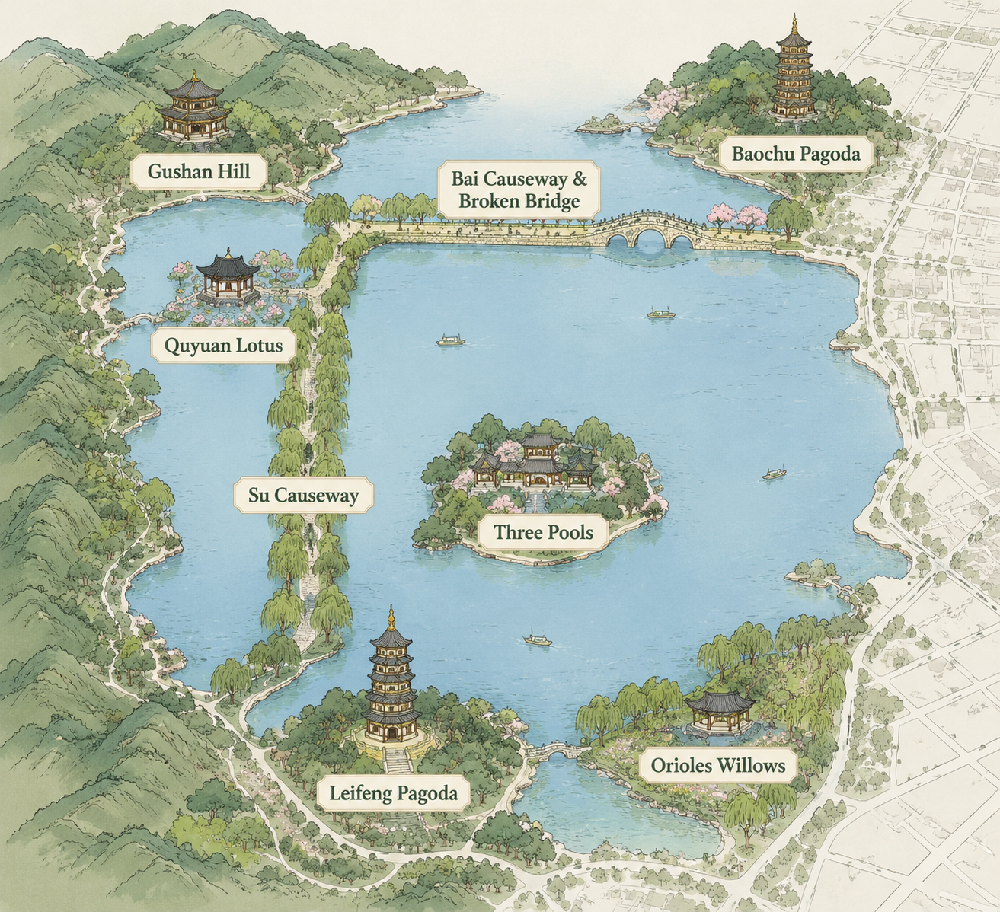

<p align="center">
  
</p>

# ChatImage

<p align="center">
  <a href="https://wencanjiang.github.io/ChatImage/"></a>
  <a href="https://wencanjiang.github.io/ChatImage/chatImage.pdf"></a>
  <a href="https://nodejs.org/"></a>
  <a href="LICENSE"></a>
</p>

> ChatImage turns a long-form LLM answer into a generated picture with clickable regions, per-region explanations, and contextual follow-up threads.

<p align="center">
  
</p>

English | [简体中文](README_CN.md)

## What ChatImage Does

ChatImage is a local-first prototype for answers that are easier to inspect visually than as paragraphs. Given a prompt, the system plans a structured visual answer, generates an image, aligns hotspots to the rendered content, and lets the user click each region for deeper explanation.

The project is designed around one core question: can a generated image become a reliable interactive answer, rather than a decorative illustration beside text?

## Highlights

- **Interactive visual answers**: generated images are overlaid with transparent clickable hotspots.
- **Region-level explanations**: each hotspot keeps its own title, summary, detail text, and follow-up conversation.
- **Vision-grounded alignment**: real-provider mode can use LocateAnything, MiMo vision, local OCR, and optional SAM mask refinement to move hotspots onto the content that was actually rendered.
- **Mock and real-provider workflows**: `mock` mode runs without keys; `api` mode proxies text, image, and vision providers through the backend so keys never reach the browser.
- **Local persistence**: ChatImages, hotspots, calibration data, and follow-up threads are stored in SQLite.
- **Text file context**: attach code, Markdown, CSV, JSON, logs, and other text-oriented files as prompt context.
- **Small frontend surface**: the browser UI is vanilla JavaScript, with a zero-dependency build script that outputs static assets into `dist/`.

## Quick Start

Requirements:

- Node.js 22.5 or newer
- npm
- Optional: Python 3.9+ for local OCR, LocateAnything, or SAM-based refinement
- Optional: CUDA GPU for local vision workers

Run the local server:

```bash
git clone https://github.com/wencanjiang/ChatImage.git
cd ChatImage
npm install
npm start
```

Open the hosted project page:

```text
https://wencanjiang.github.io/ChatImage/
```

Or open the local demo gallery after starting the server:

```text
http://127.0.0.1:5178/docs/index.html
```

Generate a deterministic local example without API keys:

```text
http://127.0.0.1:5178?provider=mock
```

## Real Providers

Copy the environment template and fill in the providers you want to use:

```bash
cp .env.example .env.local
```

On Windows PowerShell:

```powershell
Copy-Item .env.example .env.local
```

Important variables:

| Variable | Purpose |
| --- | --- |
| `CHATIMAGE_PORT` | Local server port. Defaults to `5178`. |
| `CHATIMAGE_TEXT_API_KEY` | Text model API key. |
| `CHATIMAGE_TEXT_BASE_URL` | OpenAI-compatible text API base URL. |
| `CHATIMAGE_TEXT_MODEL` | Text model name. |
| `CHATIMAGE_API_KEY` | Image generation API key. |
| `CHATIMAGE_IMAGE_MODEL` | Image generation model name. |
| `CHATIMAGE_IMAGE_API_SIZE` | Bitmap size requested from the image gateway. |
| `CHATIMAGE_VISION_MODE` | Vision mode: `local-ocr`, `locateanything`, `mimo-vision`, or `remote`. |
| `CHATIMAGE_VISION_FALLBACK_MODE` | Optional fallback vision mode. |
| `CHATIMAGE_SAM3_ENABLED` | Enables optional SAM mask refinement when configured. |
| `CHATIMAGE_DATABASE_PATH` | SQLite path. Defaults to `tmp/chatimage.sqlite`. |
| `CHATIMAGE_STATIC_DIR` | Static directory served by the backend, for example `dist` after a build. |

Keep real credentials in `.env.local`. The browser talks to the local backend, and the backend owns upstream API calls.

## Demo Gallery

The demo gallery is not a separate hand-authored path. It contains selected outputs from the same generation and alignment workflow, exported under `docs/assets/demos/` so visitors can inspect the interaction without API keys, model weights, or a GPU.

Published demos are curated for visible, useful interaction. The West Lake showcase was regenerated after fact checking, and visible map labels are kept in sync with strict vision-grounded hotspots.

| Demo | Type | Hotspots | Why it is included |
| --- | --- | ---: | --- |
| West Lake strict scenic map | Map | 9 | Broken Bridge, Bai Causeway, Su Causeway, and scenic regions all have vision-grounded SAM masks. |
| Healthy breakfast options | Scene | 6 | Everyday food objects are visually separable and useful for nutrition-oriented inspection. |
| Boutique coffee shop scene | Scene | 6 | Spatial workflow targets such as counter, seating, pastry case, and queue remain clear. |
| Sunny reading nook | Scene | 5 | A compact interior scene with stable object boundaries. |
| Independent record-store corner | Scene | 5 | Dense retail regions remain readable enough for region-level follow-up. |
| Indoor plant care corner | Scene | 5 | Small daily-care objects are distinct and easy to explain. |

Weak or rejected cases are tracked in `docs/demo-eligibility.md` to keep the public demo honest about failure modes.

## How It Works

1. The user asks a question in the browser.
2. A text model, or the deterministic mock provider, produces a long-form answer.
3. The answer is converted into a structured visual plan with regions and supporting content.
4. The image provider renders a single coherent picture from that plan.
5. The alignment stage checks where the planned regions appear in the generated image.
6. The frontend draws clickable hotspots over the verified regions.
7. Clicking a hotspot opens a focused explanation and a follow-up thread.
8. The result is saved locally so it can be revisited or calibrated later.

## Project Map

| Path | Role |
| --- | --- |
| `index.html`, `styles.css`, `src/` | Browser app, rendering, generation orchestration, layout, alignment, and interaction state. |
| `server.js`, `server/` | Local HTTP server, API routes, provider adapters, validation, and SQLite persistence. |
| `tests/` | Unit, integration, browser, provider, security, and real-diagnostics test suites. |
| `docs/` | GitHub Pages project page, report PDF, and demo gallery assets. |
| `scripts/` | Build and maintenance scripts. |

## Build

```bash
npm run build
```

Serve the built frontend:

```bash
CHATIMAGE_STATIC_DIR=dist npm start
```

On Windows PowerShell:

```powershell
$env:CHATIMAGE_STATIC_DIR = "dist"
npm start
```

## Testing

Run the full local suite:

```bash
npm test
```

Run focused suites:

```bash
npm run test:core
npm run test:server
npm run test:browser
npm run test:docs-demos
npm run test:structured-text
```

Real-provider tests are opt-in because they may call paid APIs or local model workers:

```bash
npm run test:api
npm run test:real-diagnostics
npm run test:real-visual-acceptance
```

## Documentation

| Resource | Description |
| --- | --- |
| [Technical report](https://wencanjiang.github.io/ChatImage/chatImage.pdf) | PDF report covering the task, method, implementation, and evaluation details. |
| [Project page](https://wencanjiang.github.io/ChatImage/) | Hosted project page and interactive demo gallery. |
| [Test case catalog](docs/test-cases-catalog.md) | Prompt coverage and scenario notes for common demo and evaluation cases. |

## Security Notes

- Do not commit `.env.local` or real provider keys.
- API keys are used by the backend, not exposed in frontend code.
- The server validates route inputs, image URL protocols, request body size, and hotspot bounds.
- Upstream calls use configurable timeouts and a concurrency gate.
- Local databases, generated images, and diagnostics under `tmp/` are ignored by Git.

## Roadmap

- Export interactive ChatImages as shareable HTML bundles.
- Add richer parsing for PDF, Word, spreadsheet, slide, and image inputs.
- Improve automatic visual QA for generated images and hotspot grounding.
- Add user-selectable visual templates and layout styles.
- Support cloud persistence and multi-device history.

## License

[MIT](LICENSE) (c) ChatImage Contributors
