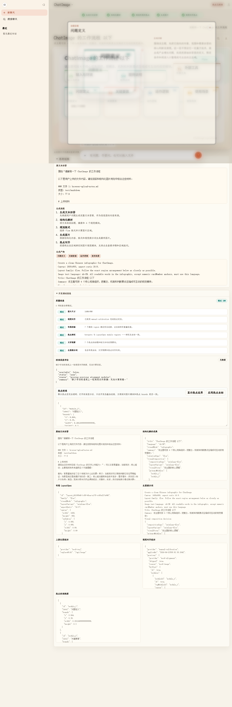

<!-- Logo / 主图 — 准备好后替换 src 为你自己的素材 -->
<p align="center">
  
</p>

# ChatImage

<p align="center">
  <!-- 预留 arXiv 论文链接 — 论文公开后填入 -->
  <a href="https://arxiv.org/abs/XXXX.XXXXX"></a>
  <!-- 预留项目 / 宣传页链接 -->
  <a href="docs/index.html"></a>
  <!-- 预留技术文档链接 -->
  <a href="docs/TECHNICAL_REPORT.md"></a>
  <a href="https://github.com/wencanjiang/ChatImage/actions"></a>
  <a href="LICENSE"></a>
  <a href="https://nodejs.org/"></a>
</p>

> 把一段长篇 LLM 回答变成可交互的视觉图像——结构化信息图叠加可点击热点，每个区域有独立详解面板和上下文追问。

<p align="center">
  
</p>

[English](README.md) | 简体中文

## 特性

- **可交互的图像回答**：把自然语言问题转成结构化视觉结果，在生成图上叠加透明可点击区域。
- **分区域详解面板**：每个热点保留独立的标题、摘要、详解文本和追问线程——点击区域即可深入，无需离开图像。
- **视觉对齐热点**：在真实 API 模式下，LocateAnything / MiMo 视觉 / 本地 OCR 定位实际视觉区域，热点落在正确内容上，而非硬编码网格。
- **与供应商无关**：可完全在无密钥的 `mock` 模式下运行，或通过后端代理真实的文本、图像、视觉供应商，密钥不进浏览器。
- **本地优先持久化**：生成的 ChatImage、热点、校准数据和追问线程存储在本地 SQLite 数据库。
- **文件上下文**：可附加文本类文件（代码、Markdown、CSV、JSON、日志等）并作为提示词上下文。
- **零前端依赖构建**：浏览器层为原生 JS；单一无依赖脚本拼接压缩资源到 `dist/`。

## 快速开始

体验 ChatImage 最快的方式是无密钥的 `mock` 模式：

```bash
git clone https://github.com/wencanjiang/ChatImage.git
cd ChatImage
npm install
npm start
```

然后打开：

```text
http://127.0.0.1:5178?provider=mock
```

若要使用真实 LLM / 图像 / 视觉供应商，复制环境示例并填入密钥（见[配置](#配置)）：

```bash
cp .env.example .env.local   # Windows: Copy-Item .env.example .env.local
npm start
```

## 环境要求

- **Node.js** 18 或更高
- **npm**
- 可选：**Python 3.9+**（若启用本地 OCR 或基于 LocateAnything 的视觉对齐）
- 可选：CUDA GPU（若本地运行 LocateAnything / SAM3 worker）

校验工具链：

```bash
node -v   # v18 或更高
npm -v
git --version
python --version   # 仅在使用本地 OCR / LocateAnything 时
```

## 从源码构建

```bash
npm install
npm run build      # 输出 dist/，含哈希命名的 JS/CSS 资源
```

通过本地服务器服务构建产物：

```bash
# Unix
CHATIMAGE_STATIC_DIR=dist npm start
# Windows PowerShell
$env:CHATIMAGE_STATIC_DIR="dist"; npm start
```

## 配置

复制环境示例文件并编辑 `.env.local`：

```bash
cp .env.example .env.local   # Windows: Copy-Item .env.example .env.local
```

关键变量（完整列表见 `.env.example`）：

| 变量 | 用途 |
| --- | --- |
| `CHATIMAGE_PORT` | 本地服务器端口，默认 `5178`。 |
| `CHATIMAGE_TEXT_API_KEY` | 文本模型 API 密钥。 |
| `CHATIMAGE_TEXT_BASE_URL` | OpenAI 兼容的文本 API 基础 URL。 |
| `CHATIMAGE_TEXT_MODEL` | 文本模型名称。 |
| `CHATIMAGE_API_KEY` | 图像生成 API 密钥。 |
| `CHATIMAGE_IMAGE_MODEL` | 图像生成模型名称。 |
| `CHATIMAGE_VISION_MODE` | 视觉对齐模式：`local-ocr`、`locateanything`、`mimo-vision`、`remote`。 |
| `CHATIMAGE_LOCATEANYTHING_MODEL` | LocateAnything 定位模型。 |
| `CHATIMAGE_SAM3_ENABLED` | 启用可选的 SAM3 掩码精修。 |
| `CHATIMAGE_DATABASE_PATH` | SQLite 数据库路径，默认 `tmp/chatimage.sqlite`。 |
| `CHATIMAGE_STATIC_DIR` | 后端服务的静态目录。 |

切勿提交 `.env.local` 或真实 API 密钥。仓库仅包含 `.env.example`。

## 运行模式

| 模式 | 需要密钥 | 行为 |
| --- | --- | --- |
| `mock` | 否 | 确定性本地供应商 + mock SVG 输出，适合开发。 |
| `api` | 是 | 通过 `server.js` 调用配置的文本、图像、视觉供应商。 |
| `auto` | — | 前端根据后端配置选择（默认）。 |

从 URL 强制指定模式：

```text
http://127.0.0.1:5178?provider=mock
http://127.0.0.1:5178?provider=api
```

## 架构

生成管线：

1. 用户在浏览器提交问题。
2. 应用获取或 mock 一段原始 LLM 回答。
3. 把回答归一化为结构化视觉 spec（`modules` + `auxiliaryModules`）。
4. ChatImage 规划 `LayoutSpec`，含区域和归一化边界。
5. 由结构化内容和布局意图生成图像提示词。
6. 图像供应商生成视觉输出。
7. 在真实 API 模式下，视觉/定位步骤定位实际视觉区域（LocateAnything → SAM3 精修）。
8. 前端在图像上叠加透明热点。
9. 点击热点打开其详解面板和追问线程。
10. 结果和线程历史本地持久化。

核心模块：

| 路径 | 职责 |
| --- | --- |
| `index.html` / `styles.css` | 应用外壳与样式。 |
| `src/app.js` | 浏览器编排与 UI 绑定。 |
| `src/service.js` | 生成与追问流程的供应商编排。 |
| `src/structure.js` | 结构化回答归一化 + mock/fallback spec。 |
| `src/layout.js` | 布局规划与热点几何。 |
| `src/alignment.js` | 视觉对齐与热点校准。 |
| `src/render.js` | 结果渲染工具。 |
| `src/preview-strategy.js` | 热点预览变体选择（抠图 / 有机羽化 / 柔化 / 掩膜）。 |
| `server.js` | 本地 HTTP 服务器与运行时配置。 |
| `server/routes/` | API 路由处理器。 |
| `server/store.js` | SQLite 持久化。 |
| `server/providers.js` | 上游供应商适配器。 |
| `scripts/build.js` | 零依赖前端构建脚本。 |
| `tests/` | 单元、集成、浏览器、供应商冒烟测试。 |
| `docs/TECHNICAL_REPORT.md` | 权威技术报告（架构、数据流、对齐管线、API、测试）。历史笔记在 `docs/archive/`。 |

## API 接口

| 接口 | 描述 |
| --- | --- |
| `GET /api/config` | 前端可见的运行时供应商配置。 |
| `POST /api/chatimages` | 生成并持久化一个 ChatImage。 |
| `GET /api/chatimages` | 列出最近的 ChatImage。 |
| `GET /api/chatimages/:id` | 加载已保存的 ChatImage。 |
| `PATCH /api/chatimages/:id` | 更新已保存的校准数据。 |
| `POST /api/chatimages/:id/hotspots/:hotspotId/thread` | 继续某热点的追问线程。 |
| `POST /api/llm` | 代理文本模型请求。 |
| `POST /api/image` | 代理图像生成请求。 |
| `POST /api/vision` | 代理视觉对齐请求。 |

## 测试

运行完整本地回归套件：

```bash
npm test
```

运行选定套件：

```bash
npm run test:core
npm run test:server
npm run test:browser
npm run test:structured-text
```

若浏览器测试启动器无法自动找到 Chrome 或 Edge：

```bash
# Unix
CHATIMAGE_BROWSER_PATH=/path/to/chrome npm run test:browser
# Windows PowerShell
$env:CHATIMAGE_BROWSER_PATH="C:\path\to\chrome.exe"; npm run test:browser
```

真实供应商冒烟测试需 opt-in，因为可能调用付费 API：

```bash
CHATIMAGE_API_KEY=your_key_here npm run test:api
```

## 技术栈

- **前端**：原生 JS（浏览器全局变量），无框架，无打包运行时
- **后端**：Node.js HTTP 服务器（无外部 Web 框架）
- **持久化**：SQLite（经 `better-sqlite3`）
- **视觉对齐**：LocateAnything（视觉定位）、MiMo 视觉、本地 OCR、可选 SAM3 掩码精修
- **构建**：单一零依赖拼接压缩脚本 → `dist/`
- **测试**：Node `assert` + 无头 Chrome/CDP 浏览器断言

## 引用

若 ChatImage 对你的研究有帮助，请引用。正式论文在准备中——上方的 arXiv 链接将在论文公开后激活。

```bibtex
@misc{chatimage2026,
  title  = {ChatImage: Turning Long-Form LLM Answers into Interactive Visual Images},
  author = {ChatImage Contributors},
  year   = {2026},
  url    = {https://github.com/wencanjiang/ChatImage}
}
```

## 安全

- 所有 API 密钥保存在 `.env.local`，切勿暴露在前端代码中。
- 后端校验负载结构、图像 URL 协议、热点边界和路由输入。
- 上游调用使用可配置超时和并发闸门，避免请求失控。
- `tmp/` 下的生成数据库、截图、诊断信息被 Git 忽略。

## 路线图

- 把可交互 ChatImage 导出为可分享的 HTML 包。
- 更丰富的 PDF、Word、PowerPoint、Excel、图像输入解析。
- 云端持久化与多设备历史同步。
- 用户可选的视觉模板与布局样式。
- 对生成图像和热点精度的自动化视觉 QA。

## 许可证

[MIT](LICENSE) © ChatImage Contributors
